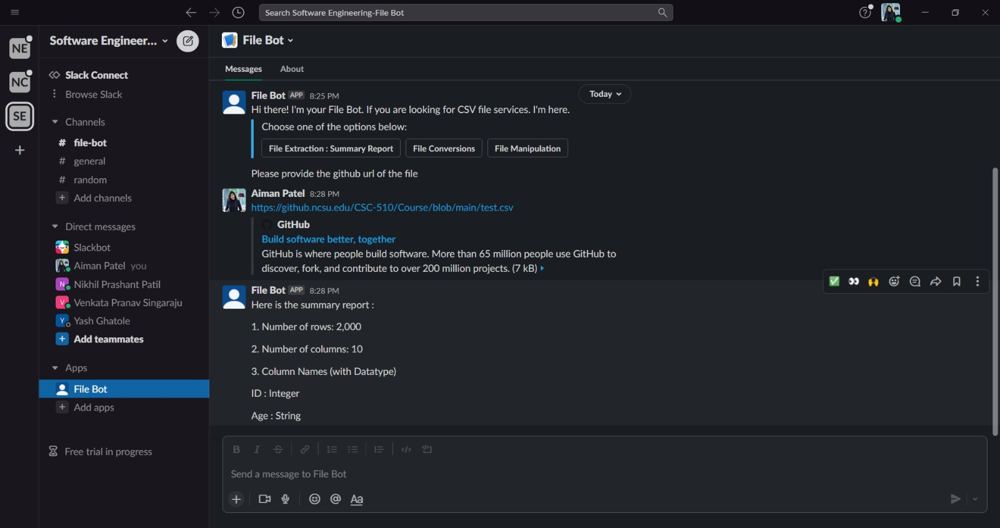
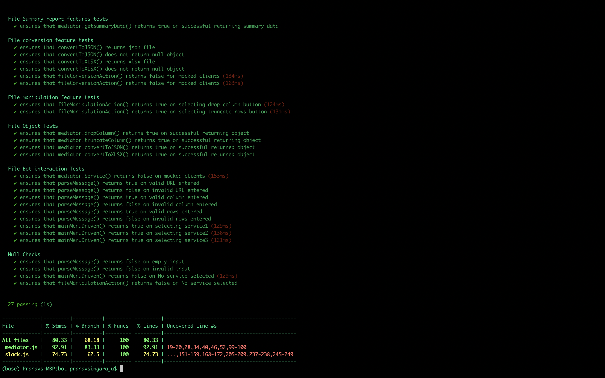
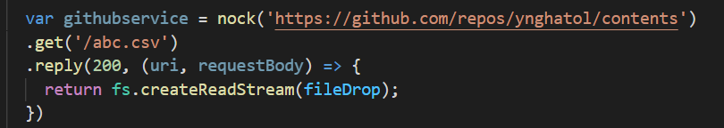

# Bot

* Friday 11th March.  
---

## Bot Platform Implementation

We have implemented a fully operational bot within slack which responds to commands described in the usecases.
1. The bot will repond to a command "/filebotBot".
2. The bot will provide 3 options. 
3. The bot asks for git URL (based on option selected by the user).
4. The bot process the user query and returns the desired response.

One of the response is shown in the image below.

   

## Use Case Refinement

As stated in the feedback, usecases 1 and 4 were similar, we removed the usecase 4. Now, we have 3 usecases as stated below with the changes made:
1. Display Summary Report of a CSV File - Instead of File name, user will provide the File GitHub URL
2. File Conversion - We will be returning the updated file instead of a pull request link to the user. The user can then be able to download the updated file from slack. 
3. File Manipulation: Drop columns/Rows - Similarly, in this usecase bot will return the updated file after truncating or dropping a column. 

## Testing

We have written test cases for all the usecases as below -
1. File conversion feature tests
2. File manipulation feature tests
3. File Object Tests
4. File Bot interaction Tests
5. Null Checks

Click [here](https://github.ncsu.edu/csc510-s2022/CSC510-15/blob/main/bot/test/test.js) to see the test.js

Below, is the ouput of our test case coverage

   

## Mocking infrastructure

Bot will be interacting only once with GitHub to fetch the file and for that we have written the mocking service. For other usecases drop columns, truncate rows, and get summary report we are returning a local file as a part of mocking response to the user. 
In test.js, we are mocking the client wthout providing bot related tokens, such that all of the interactions can be tested without revealing such tokens.

We have done it as shown below- 

   

## Screencast

Here is the screencast link ---> [Link to screencast](https://web.microsoftstream.com/video/66bd2816-07cd-409b-b0d8-fe1b22097c0f)
