# DESIGN DOCUMENTATION

## :large_blue_diamond: Problem Statement:

- The problem is software developers don’t have a platform where they can perform manipulations on CSV files while working on a project. Some of the tasks includes file extraction:summary statistics, file conversions, and file manipulations.

- This is important because while working on projects, developers have many tasks related to files, for them to write API/methods for each functionality or having a local copy of the files and manipulating it on the fly is a very tedious task.

- The solution to the above problem is to have an interactive File Bot which performs functions like counting number of rows, columns, extracting datatype of columns, dropping a column, truncating rows, and converting file from one extension to another on CSV files in a git repo. This will refrain developers from writing different APIs for different file processing/manipulation functionalities.

## :large_blue_diamond: Bot Description:

- Our Filebot is a conversational bot on Slack platform which eases the life of developers working on analytical task such as file i/o, file conversions, file manipulation, etc. Moreover, there are other interesting task that the bot can perform like providing comprehensive analytical report of summary statistics, and basic file handling as mentioned above.  

- There would be a two-way interaction between the user and the bot, wherein users would initially input the files over which the manipulation has to be performed, while the bot would acknowledge the user with the menu-driven functionalities. As the task is chosen, the bot will implement the given functionality and add the changes to the specified remote repo and create a merge pull request.

- Our FileBot is capable of delivering immediate feedback once the query has been submitted by the user to obtain the desired file manipulation. Hence, saving a lot of time as the developer doesn’t have to spend time on scripting such functionalities on their own. Therefore, developers can focus on other problem-solving related task without worrying about the file handling capabilities.

:arrow\_forward: **_Tag Line:_** \_Comma Separated Value Added\_

## :large_blue_diamond: Use Cases:

### :small_blue_diamond: Use Case - 1

```
Use Case: Display Summary Report of a CSV File
1.1 Preconditions
   User must have Github api tokens and Bot must be given access to the github repository.
1.2 Main Flow
User will select File Extraction : Summary Report option from the menu driven options [S1]. The bot asks for the url of the particular CSV file [S2]. User will provide the url of the file for which he wants a summary report [S3]. Bot checks and process the information provided by User [S4]. Bot provides the summary report of the corresponding csv file [S5].
1.3 Subflows
  [S4] Bot checks if url is valid: Checks if the url is valid or not [S5,E1]
  [S5] Bot will return the summary report which includes number of rows in the csv file, number of columns, column names and column types.
1.4 Alternative Flows
  [E1] File url not valid: prompts the user that file url is not valid.
```

### :small_blue_diamond: Use Case - 2

```
Use Case: File Conversion
2.1 Preconditions
    User must have Github api tokens and Bot must be given access to the github repository. File url to be mentioned for the conversion and its conversion format
2.2 Main Flow
This use case begins when user selects file conversion from the menu-driven options. The bot checks if file url is valid [S1], the current format of the file [S2], and the desired conversion format [S3]. The use case ends when the bot completes the file conversion and creates a pull request onto the respective git repo [S4].

2.3 Subflows
  [S1] Check if url is valid: Checks if the url is valid or not[S2, E1].
  [S2] Check Format: Retrieve the current format of the file [S3].
  [S3] Check Conversion: Check if the desire conversion is applicable to file [S4, E2].
  [S4] Convert the File: Convert the file to required extension and return the updated file. 

Alternative Flows
  [E1] File url not valid: prompts the user that file url is not valid.
  [E2] Format not exist: Prompt the user to input valid file format.

```

### :small_blue_diamond: Use Case - 3

```
Use Case: File Manipulation: Drop a column
3.1 Preconditions
   User must have GitHub API tokens and Bot must be given access to the GitHub repository.

3.2 Main Flow
User will select File Manipulation option from the menu driven options [S1]. After, that bot displays two options: Drop a column and Truncate a file [S2]. User selects the Drop a column option from the menu-driven options [S3]. The bot asks for the url of the CSV file [S4]. User will provide the name of the file in which the user wants to remove a column [S5]. Bot checks and processes the information provided by the User [S6]. The bot provides the updated file [S7].

3.3 Sub flows
  [S6] Bot checks the file format provided by the User [S7,E1]
  [S6] Bot checks the existence of column in file in the GitHub repository [S7,E2]
  [S7] Bot will return the updated file which includes the requested change like dropping a column

3.4 Alternative Flows
  [E1] File url not valid: prompts the user that file url is not valid.
  [E2] Column does not exist: Prompts the user to input a valid column.
  
```

## :large_blue_diamond: Design Sketches:

### :small_blue_diamond: Wireframes

Following wireframes will showcase the visualization and layout of the File Bot interactions with the developer on Slack platform. <br>

To depict the navigation and conversations with the File Bot, we have considered Use case 1 and Use case 3. Following wireframes will provide a look and feel of File Bot services on Slack platform. Also, it helps in understanding the behaviour and actions of File Bot.

### Wireframe

<p float="left">
  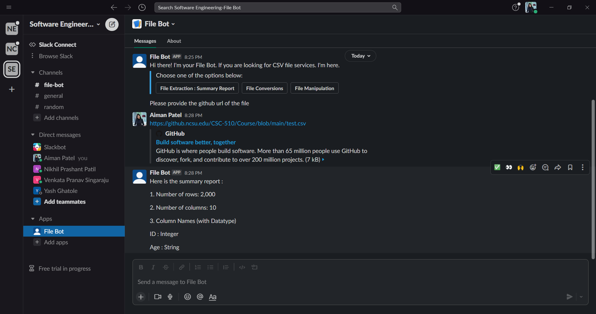
  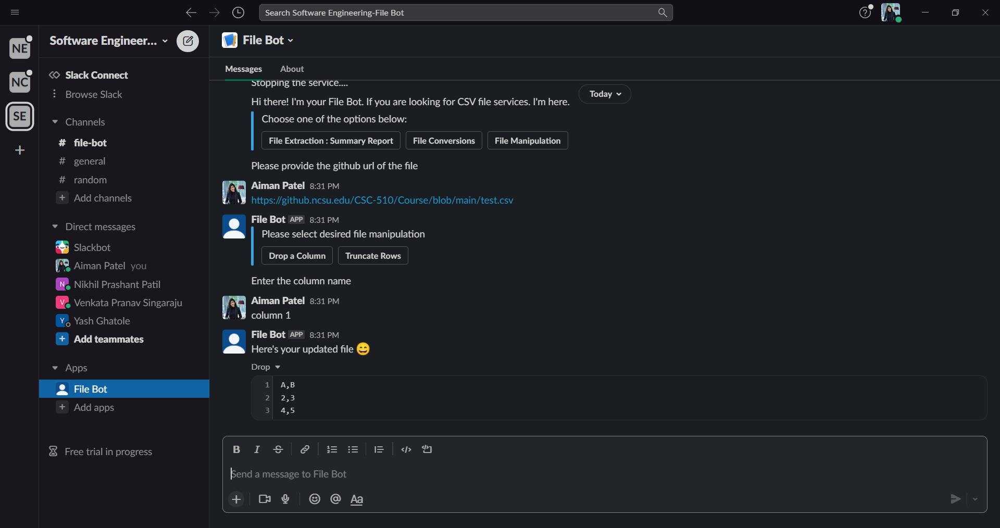 
</p>

### :small_blue_diamond: Storyboard

Following is a StoryBoard which will show the primary task that a user undergoes with our FileBot.

<p float="left">
  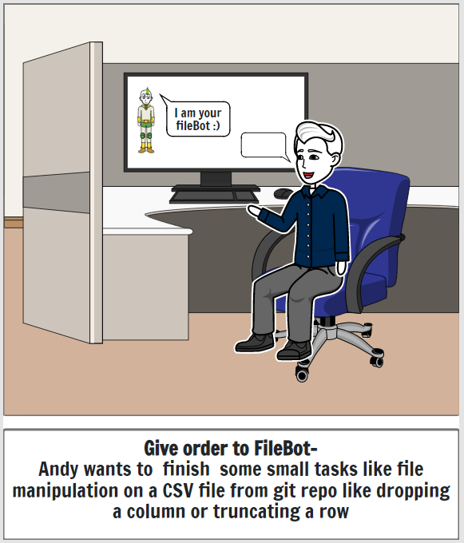
  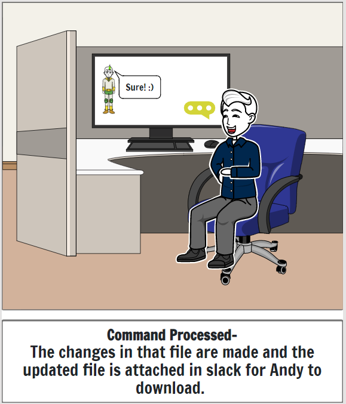
  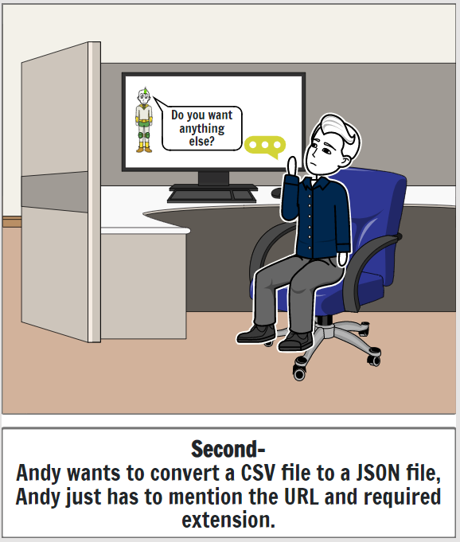
  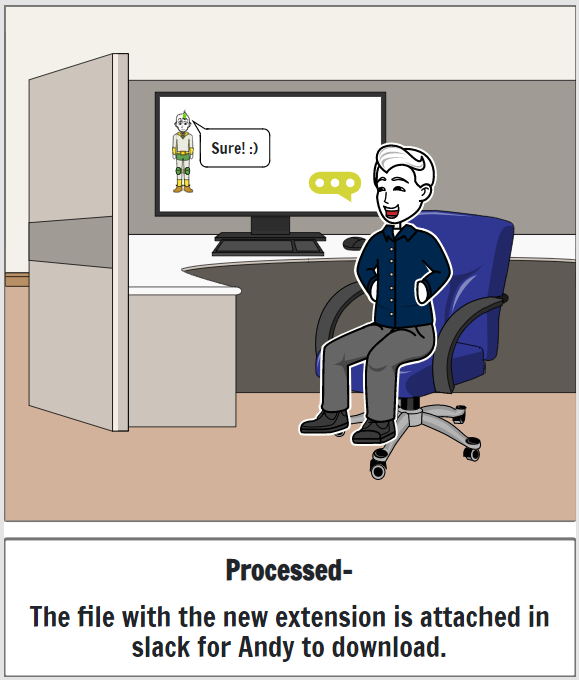
  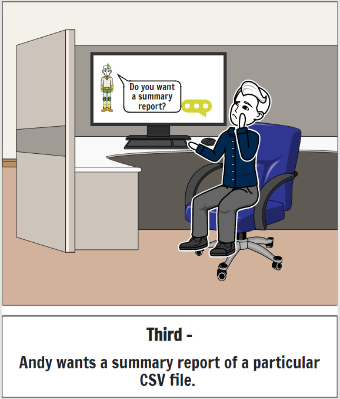
  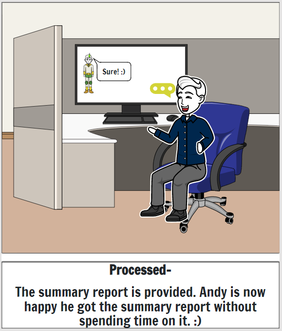
</p>

## :large_blue_diamond: Architecture Design + Additonal Patterns:

The below architecture design depicts the platform, third-party services and the interactions of File Bot with them. Here, the platform is Slack and the File Bot will interact with the GitHub and Slack through REST APIs.

### :small_blue_diamond: High level Design

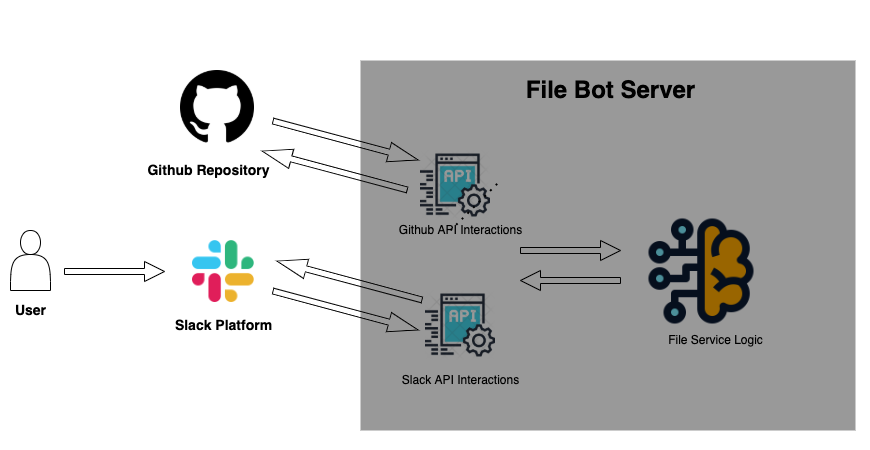


###  :small_blue_diamond: File Services
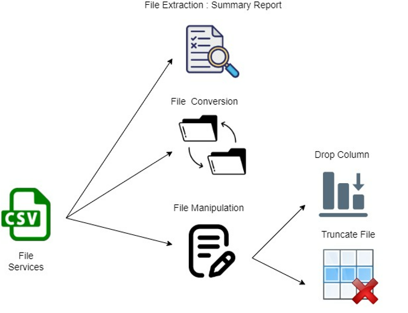


### :small_blue_diamond: Component Diagram:

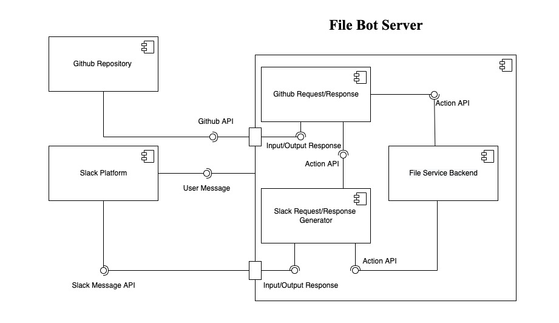

### :small_blue_diamond: Description:

- **User**: Interacts with the slack platform to invoke the File Bot, wherein the user would be asked to choose the desired services to be performed by the bot and receive the desired response in return onto the slack platform.

- **Slack platform**: It will be a channel for users to interact with bot. Users can submit their commands or can have conversation with bot to perform their file related functionalities via this channel.

- **GitHub Repository**: It is used to organize a single project. Repositories can contain folders and files, images, videos, spreadsheets, and data sets -- anything that project needs.

- **GitHub API Interactions**: Responsible for retrieving the repository details such as a number of files, name of the files, fetching the queried file, etc.

- **Slack API Interactions**: It can be considered as bot's equivalent of eyes and ears. It gives a bot a way to react to posted messages and other activities that happen in Slack. When these events happen, a data payload will be sent to your bot, and it can use that data to form a useful response.

- **File Service logic**: It is the business logic for the services that is being provided the bot, where actual file writing, manipulation, feature engineering, and file conversions can be performed and posted back to the bot so that appropriate feedback can be delivered on the Slack Platform.

Following are the services provided:

:one: File Extraction : Summary Report <br>
:two: File Conversions <br>
:three: File Manipulation <br>


- ### File Extraction : Summary Report

  - In this, the bot will take the input CSV file specified by the user and respond with the summary of the data present in the file, such as number of rows, columns, and column datatype.

- ### File Conversions

   - Here, the bot will convert the given file from CSV to the mentioned file format (JSON, XLSX) desired by the user (e.g., File.csv to File.xlsx) and return the updated file.  

- ### File Manipulation
   - There are two options provided by the bot dropping a column or truncating the rows for this file service. As per the requirement, File Bot will do the task and return the updated file. 


### :small_blue_diamond: File Bot Constraints/Guidelines:

- Invoke the File Bot with a specific command
- The File Bot has restricted conversations relevant to the services.
- The bot should be added as a contributor in the mentioned git repository where the CSV file resides or the repository should be publicly accessible.
- File Bot Works only with CSV files.
- File Bot is available only on Slack.
- Once, the File Bot gets to the end of any happy flow/ alternative flow, the user have to start the conversation over again (Reactor bot, memoryless).

### :small_blue_diamond: Design Patterns:

- For the File Bot interaction with third-party services such as GitHub and Slack, we would be designing the factory pattern where an interface would be inherited by the GitHub API interactions and Slack API interactions components mentioned in the architecture diagram.

- In order to have objects loosely coupled, we will be using a mediator pattern between Slack API interactions, GitHub API interactions, and File service logics, objects will interact via mediator instead of interacting with each other. Also, the mediator will be responsible for file open, close, read, write, etc.

