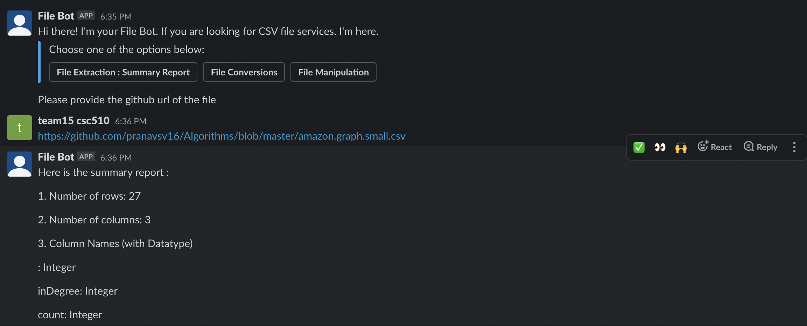
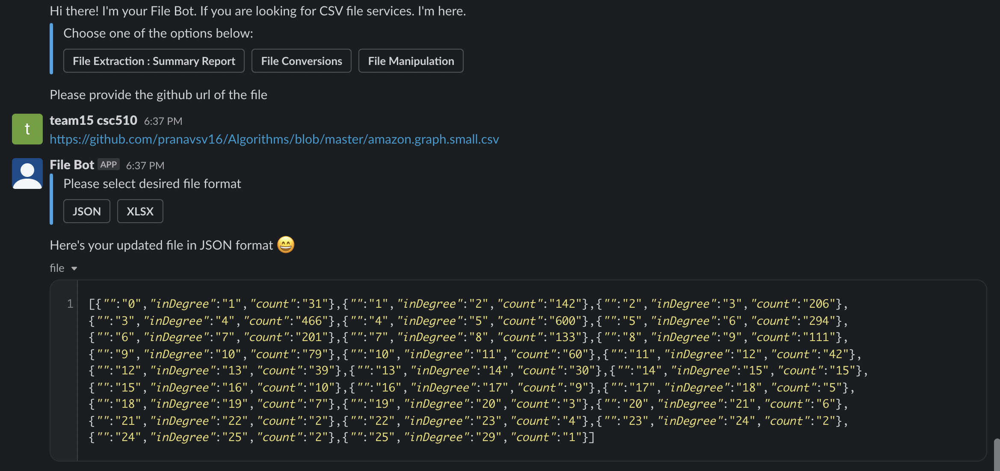
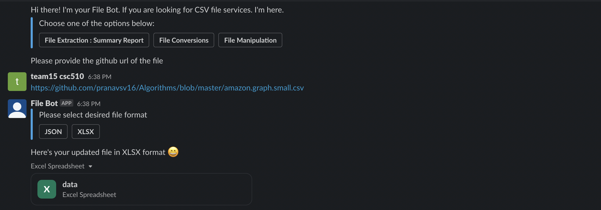
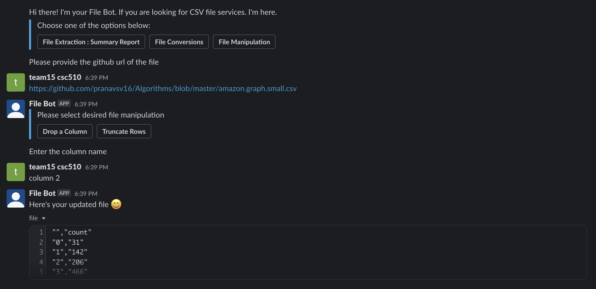
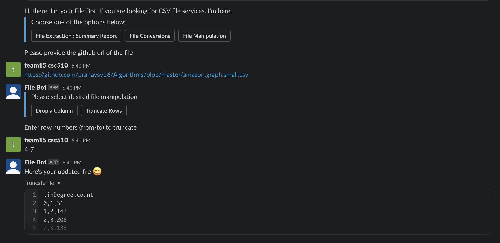

# File Bot - Report

## :question: Problem & Solution: File Bot

* The problem is software developers don’t have a platform where they can perform manipulations on CSV files while working on a project. 

* This is important because while working on projects, developers have many tasks related to files, for which 

  * Developers have to write API/methods for each functionality 
  * Developers have to maintain copy of the files locally
  * Developers have to manipulate files on the fly which is a very tedious task.

* The solution to the above problem is to have an interactive File Bot which performs functions: counting number of rows, columns, extracting datatype of columns, dropping a column, truncating rows, and converting file from one extension to another on CSV files in a git repo. 

* This will refrain developers from writing different APIs for different file processing/manipulation functionalities.

## :white_check_mark: File Bot Features.

The File Bot is integrated with the Slack platform and the below screenshots depicts the three main features :

* File Extraction: Summary Report

  

* File Conversion
	* CSV to JSON

  

	* CSV to XLSX

  

	
* File Manipulation
	* Drop a Column

  

	* Truncate Rows

  

## :arrows_clockwise: Project & Process Reflection
#### Design Milestone
* Firstly, researching about the current software engineering task, how that task can be automated 
  helping the developers into their day-to-day activities without spending time on scripting.
* Came up with the problem statement of file manipulation especially in CSV files, which is heavily
  used in an analytical environment.
* Wireframes helped us in getting the look and feel of the File Bot.
* Designing the important and at the same time feasible use-cases within the given time-frame.
* Iterating through multiple designs aided us to choose the best possible design. Working on the
  architetural design of the application helped us understand the end-to-end dataflow and recognize 
  the individual components present in the application.
* The design patterns(mediator pattern) helped us in designing the main components of the bot in the design milestone.
  
#### Bot Milestone
* Creating the initial framework for the bot interaction and its connection with the Slack Channel.
* Understanding the significance of test coverage, which made sure that every component/functionality we
  implemented was utilized efficiently. Hence, improving the coding standards and reducing the overhead
  writing of functions.
* Writing the unit test-case for the initial framework and interacting with it through mocking the client
  ensured that the bot responded as required and this milestone act as a stepping stone for our feature/
  use-case implementation.

#### Process
* The Extreme Programming's core (Fine-scale feedback: Pair Programming, Shared Understanding) and corollary practices (Shared Code) helped us in delivering a robust bot in a given timeframe.
* Following Scrum methodology helped us in undersatnding the status of project/issues, assigning story points and dividing the tasks efficiently amongst the team members.
* Through Kanban board, we were able to track the stale issues , current bugs and reviewing the PRs.
* Worked with GitHub API, by fetching the files and parsing those into the required format.
* Written the logics for the use-case especially for file-summary, truncate-rows and drop a column.
* Stored the files in-memory, working and implementing the Slack API, such as file upload/download.
* Leveraged the existing libraries for converting the files to respective format such as XLSX/JSON.
* Written the test-cases, based on the logic of use-cases.

#### Deployment
* Learnt about Configuration Management and Continuous Integration and configured the server and moved the current application onto the server by using Ansible (.yml file)
* Written independent task that has to be followed similar to the build-up of local environment so that the 
  server has the required dependencies installed and the directory access since, our case demands 
  in-memory file manipulation 
* Running the server forever so that the FileBot can be made remotely accessible through the test channel

## :exclamation: Limitations of File Bot

Our File Bot has the following limitations:

* The File Bot doesn't work if the Github repository is not a public repo.

* The Bot works only on the CSV files and doesn't support any other files.

* The Bot is not scaled up to work on a large set of users.

* Curently, the Bot is available only on one channel in a particular worksapce in Slack.

* We haven't implemented the security feature for this bot which can be considered in the further work. 

## :fast_forward: Future Work

For future work, we would like to 

* Include more services in filebot which would help data analysts, data scientists like
  * Calculate correlation between various columns in csv file
  * Detect outliers in data
  * Feature engineering 
  * Generate visualizations like pie chart, histogram based on data in csv file

* Make filebot available on other channels like telegram, microsoft teams apart from slack.
* Make filebot more secure by performing software security testing .
* Include support for other file formats like pdf, txt, jpeg, etc.
* Enhance access to private github repositories.

## [Project Video](https://web.microsoftstream.com/video/b3ce28fb-74ab-4134-8870-03891eabd878)

## [Project PPT](https://github.ncsu.edu/csc510-s2022/CSC510-15/blob/main/FileBot.pdf)
