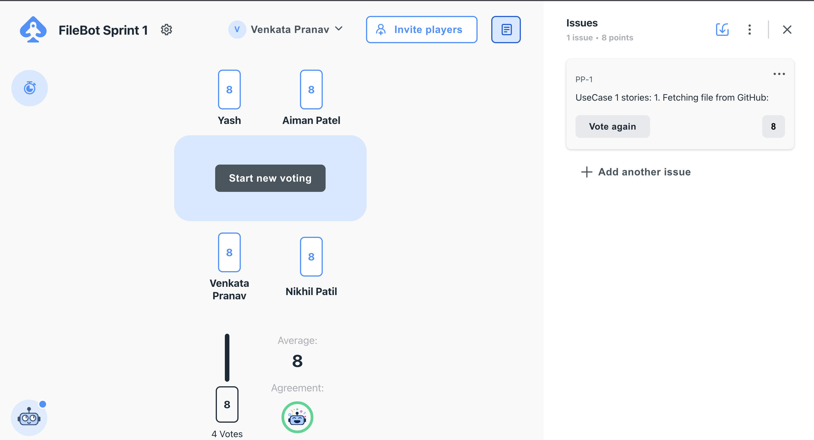
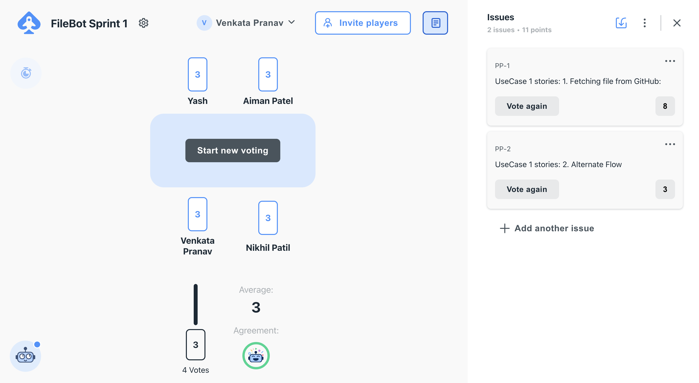
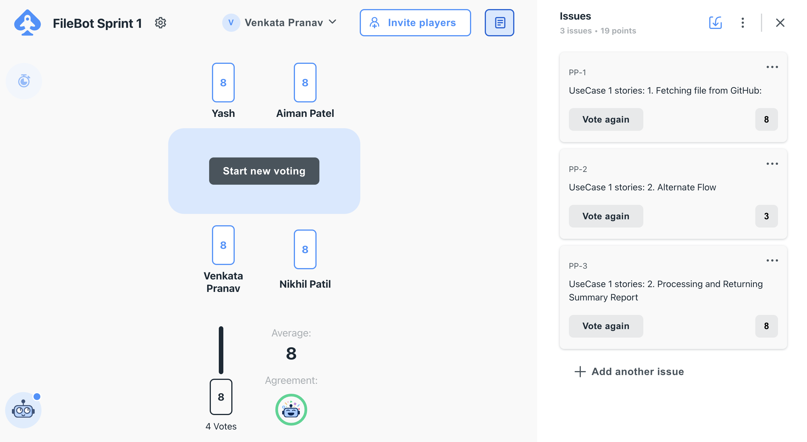
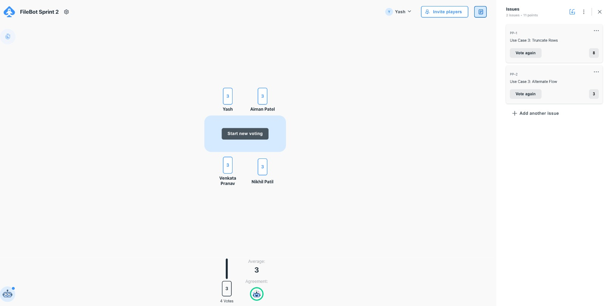
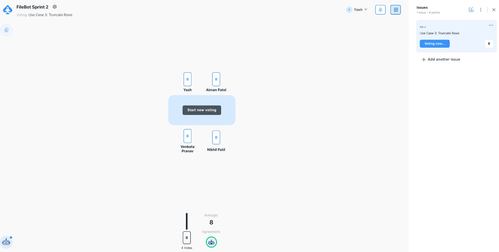
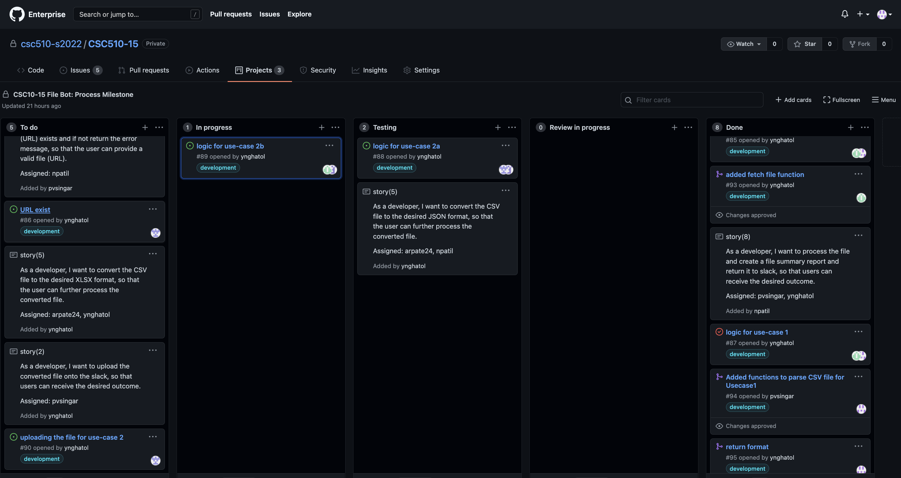

# Process Documentation

## Sprint Week 1 and 2 - Iteration

### Scrum Planning: Story Creation and Assignment

The following are the stroies created during sprint planning for week 1

Story 			   | Story Points | Developer Assigned |
--------------- | ------------ | ------------------ |
Sprint planning | 3					| pvsingar, ynghatol, npatil, arpate24
Fetching file from Github(common functionality)   | 8 | pvsingar, ynghatol
Process File and Generate Summary Report (Usecase 1) | 8 | pvsingar, ynghatol
URL exists - Aternate flow (common functionality)|3| npatil
CSV - JSON functionality (Usecase 2)|5| arpate24, npatil
CSV - XLSX functionality (Usecase 2)|5| arpate24, npatil
Uploading File functionality |2|arpate24, npatil
Creating process.md file|2| pvsingar
Creating worksheet.md file|1| arpate24


The above story points were assigned during sprint planning by using Planning Poker website. Here are the screenshots:

<p float="left">
  
  
  
</p>

The following are the stroies created during sprint planning for week 2

Story 			   | Story Points | Developer Assigned |
--------------- | ------------ | ------------------ |
Sprint planning | 3					| pvsingar, ynghatol, npatil, arpate24
Fix existing testcases   | 3 | arpate24, ynghatol
Logic for Usecase 3a (Truncating rows) | 8 | pvsingar, ynghatol
Logic for Usecase 3b (Drop Columns)|8| npatil
Add new testcases for UC1,2,3 |5| arpate24, npatil
Alternate flow for UC 3a |5| arpate24, npatil
Alternate flow for UC 3b |2|arpate24, npatil
Updating process.md file|2| arpate24
Updating worksheet.md file|1| arpate24


<p float="left">
  
  
</p>

Below is the Github project board (Kanban board) screenshot:
<p float="left">
   
</p>

### Scrum Meeting Notes - Process Notes

We have documented the Scrum notes in a particular format and have documented everything in a Microsoft-one note document which can be found here: [Scrum Notes](https://oitncsu-my.sharepoint.com/personal/ynghatol_ncsu_edu/_layouts/15/Doc.aspx?sourcedoc={bce2aa24-6b0b-462a-9f30-7c8aa530aaa9}&action=edit&wd=target%28Sprint%20Planning.one%7C6341af86-2ef2-4d1f-9914-a23afd1b5631%2F03-21-2022%7C9a6e9b6c-7d5a-434a-adaa-5cbf931f7e72%2F%29).

Below is the Scrum Notes of 03/23/2022.

|<p align="left">**Scrum Master**</p>| 	<span style="font-weight:normal;float:left">arpate24</span> | 
--------------- | ------------ |
**Devlopers Attended** 	| pvsingar, ynghatol, npatil, arpate24|
***What did you do since last Scrum meeting?***|:white_check_mark: ynghatol   –   Formatting of return data. <br/> :white_check_mark: pvsingar   –   Testing the changes on slack. <br/>:white_check_mark: npatil – Researched about csv to json conversion.  </br>  :white_check_mark: arpate24  – Researched about csv to xlsx conversion.|
**What did we do?** | (During Scrum call, developers gave their updates)</br>(After Scrum call)</br> :small_blue_diamond: Reviewed Use Case 1 code before pushing. </br> :small_blue_diamond: Tested and pushed to the development branch.|
**What will you do before next meeting?** |pvsingar   –   Work on process.md.</br>npatil        –   Work on Usecase 2.</br>arpate24  –  Work on Usecase 2.</br> ynghatol   –   Review process.md file.|
**Do we have any obstacles in the way?** |NA| 

### Practices

:large_orange_diamond: ***Core Practices:*** The following are few core practices that our team followed.

1. ***Fine-scale feedback: Pair Programming***
2. ***Shared Understanding***

Most of the stories that we created during Sprint planning were completed by involving pair of developers. It has helped in developing code with less bugs. Also, because of interactions, ideas were shared leading to a better implementation of stories.

Our team followed the Shared Understanding including Coding Standards, Collective Code ownership, Simple Design and System Metaphor. We ensured that we follow basic coding standards across the project modules and also we have collective ownership on different modules of code following an overall simple design. We have simple shared story of how the system works (limited to 3 usecases) but common flow involving classes and patterns.

:large_orange_diamond: Corollary Practices: The following are few corollary practices that our team followed.

1. ***Real Customer Involvement***
2. ***Incremental Deployment***
3. ***Shared Code***

Daily, one of the developers acted as a customer during calls to ensure and think in customer's perspective of how the product should be and to clarify any stories and help in making business decisions.

Our team ensured that we deployed (developed) code incrementally and pushed changes to the branch. We ensured that large chunks of development is not done in one merge/transaction.

Though we have Collective Code Ownership, the code is modified and improved by other team members. We followed this practice since the start of this project.


#### Iteration Worksheet
Click [here](https://github.ncsu.edu/csc510-s2022/CSC510-15/blob/development_branch/worksheet.md) to check the iteration worksheet

###### Note:
To run the test cases follow the below procedure
- Comment line number from 316 to 320 in bot/slack.js
- cd into bot and then run "npx c8 npm test"

###  Process Refelction

We learnt the core and corollary practices of XP Practice and we followed ``` Pair Programming``` ,```Shared Understanding``` and ```Shared Code``` extensively through out the Process milestone and also during the Deploy milestone.

1. Pair Programming helped us in resolving many bugs while developing the usecases and hence we encountered very less number of bugs.

2. By following Shared Code practice, developers optimized differet blocks of code which helped us later in developing other usecases.

3. By following Shared Understanding, which includes Coding Standards, Collective Code ownership, it helped us in developing different sections of the bot in quick time and with ease.

By following Scrum-Ban, we tracked our tasks and issues regualry and had a clear plan of what to do during the sprints. Also, each developer is aware of what other developers are working on and this helped us in resolving and fixing the dependencies and obstacles.


### Proof that we followed the above mentioned practices:

We followed ***pair programming*** and the proof for that is the issues that we created. We created issues and assigned it to 2 developers, so that, both of them will work on it and one person will be merging that into branch.

Example:https://github.ncsu.edu/csc510-s2022/CSC510-15/issues/85



There are many such issues which are completed/fixed by pair programming.


***Shared Code:*** For this, our commits are the proof, we made sure that any developer in the team can modify/improve or optimize any part of the code by adhering to Coding Standards and Collective Ownership. There are many commits and transactions which can be considered as a proof.


